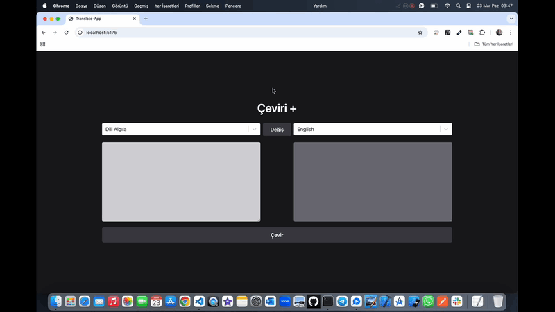

# Translate-App 📕

<li>Bu proje Dünya geneli bütün dillerin tercümesinin yapıldığı platformdur.</li>
<li>Tercümesi yapılacak dili sistem Otomatik Algılama özelliği ile bulmaktadır.</li>
<li>Kullanıcı dostu responsive tasarımı mevcuttur.</li>

# Kullanılan Teknolojiler 🎨

<li>⭐ React</li>
<li>⭐ Vite</li>
<li>⭐ Toolkit</li>
<li>⭐ TailwindCss</li>
<li>⭐ Redux</li>
<li>⭐ React-Select</li>
<li>⭐ Axios</li>
<li>⭐ Apı</li>

# Ekran Görüntüsü 🎥
      

# İletişim 📩
yunusemreoral@hotmail.com.tr
